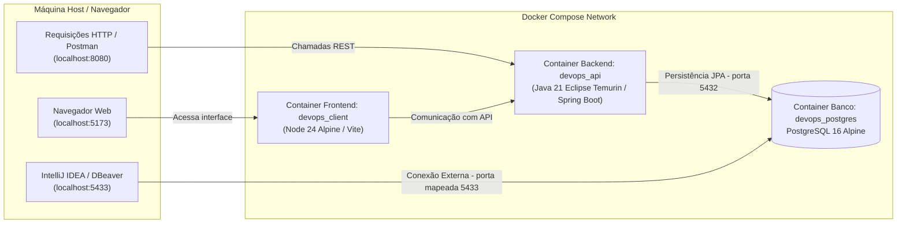

# 🎮 Gamificação - Prática 5 DevOps (Grupo 7)

Projeto desenvolvido como parte da disciplina de Prática 5 de DevOps. Trata-se de uma aplicação full stack com arquitetura monorepo composta por:
- **Backend (`api/`)**: API REST desenvolvida em **Java 21** com **Spring Boot 4**, **Spring Data JPA**, **Hibernate** e conexão com banco de dados relacional.
- **Frontend (`client/`)**: Aplicação web desenvolvida com **React 19**, **TypeScript** e **Vite**.
- **Banco de Dados (`postgres`)**: **PostgreSQL 16 (Alpine)** executado em container Docker.
- **Orquestração & DevOps**: Ambientes containerizados com **Docker** e **Docker Compose**, contando com suporte a multi-stage builds e **Docker Compose Watch** para sincronização em tempo real (hot-reload).

## 👥 Integrantes do Grupo

| Nome | RA |
|---|---|
| Enzo Yamaoca Borlini | 236774 |
| Giovanne Vieira de Queiroz | 235969 |
| Lucas Marino Tomazeli | 235798 |

---

## 📋 Sumário

- [Integrantes do Grupo](#-integrantes-do-grupo)
- [Visão Geral e Arquitetura](#-visão-geral-e-arquitetura)
- [Mapeamento de Portas e Serviços](#-mapeamento-de-portas-e-serviços)
- [Pré-requisitos](#-pré-requisitos)
- [Como Clonar o Repositório](#-como-clonar-o-repositório)
- [Configuração de Variáveis de Ambiente](#-configuração-de-variáveis-de-ambiente)
- [Como Executar e Compilar via Docker](#-como-executar-e-compilar-via-docker-recomendado)
  - [Subindo o Ambiente Completo](#subindo-o-ambiente-completo)
  - [Desenvolvimento com Docker Watch (Hot-Reload)](#desenvolvimento-com-docker-watch-hot-reload)
  - [Compilação Manual das Imagens Docker (Multi-Stage Builds)](#compilação-manual-das-imagens-docker-multi-stage-builds)
  - [Executando Testes dentro dos Containers Docker](#executando-testes-dentro-dos-containers-docker)
  - [Comandos Úteis do Docker Compose](#comandos-úteis-do-docker-compose)
- [Como Compilar e Executar Normalmente (Local / Sem Docker)](#-como-compilar-e-executar-normalmente-local--sem-docker)
  - [Passo 1: Subir Apenas o Banco PostgreSQL](#passo-1-subir-apenas-o-banco-postgresql)
  - [Passo 2: Backend (Spring Boot)](#passo-2-backend-spring-boot)
  - [Passo 3: Frontend (React + Vite)](#passo-3-frontend-react--vite)
- [Como Conectar ao PostgreSQL pelo IntelliJ IDEA](#-como-conectar-ao-postgresql-pelo-intellij-idea)
- [Endpoints da API e Exemplos de Uso](#-endpoints-da-api-e-exemplos-de-uso)
  - [Documentação interativa (Swagger UI / OpenAPI)](#8-documentação-interativa-swagger-ui--openapi)
- [Metodologia ATDD — Passo a Passo dos TDDs](#-metodologia-atdd--passo-a-passo-dos-tdds)
- [Estrutura de Pastas do Repositório](#-estrutura-de-pastas-do-repositório)
- [Resolução de Problemas (Troubleshooting)](#-resolução-de-problemas-troubleshooting)

---

## 🏛 Visão Geral e Arquitetura



---

## 🔌 Mapeamento de Portas e Serviços

| Serviço | Nome do Container | Porta no Container | Porta no Host (Localhost) | Descrição |
| :--- | :--- | :---: | :---: | :--- |
| **API** | `devops_api` | `8080` | `8080` | Servidor REST Spring Boot |
| **API (Debug)** | `devops_api` | `5005` | `5005` | Porta para Remote Debugging JVM |
| **Client** | `devops_client` | `5173` | `5173` | Servidor de desenvolvimento Vite |
| **PostgreSQL** | `devops_postgres` | `5432` | **`5433`** | Banco de dados (*Atenção à porta 5433 no host*) |

> [!WARNING]
> **Atenção à porta do PostgreSQL**: No host, o PostgreSQL está exposto na porta **`5433`** (para não conflitar com possíveis instâncias locais do Postgres rodando na 5432). Dentro da rede Docker dos containers, a porta interna usada pela API é a **`5432`**.

---

## 🧰 Pré-requisitos

### Para rodar via Docker:
- [Docker](https://www.docker.com/) (versão 24 ou superior)
- [Docker Compose](https://docs.docker.com/compose/) (versão 2.20 ou superior com suporte a `develop.watch`)

### Para compilar e rodar localmente (sem Docker nos apps):
- [Java JDK 21](https://adoptium.net/) configurado no sistema (`JAVA_HOME`)
- [Node.js](https://nodejs.org/) versão 20 LTS ou 24 LTS e gerenciador `npm`
- [Maven](https://maven.apache.org/) (opcional, pois o projeto já inclui o Maven Wrapper `mvnw` e `mvnw.cmd`)
- Uma instância do PostgreSQL ativa (pode ser executada via container)
- [Git](https://git-scm.com/) instalado no sistema

---

## 📥 Como Clonar o Repositório

Para obter o código-fonte na sua máquina local:

```bash
# 1. Clonar o repositório via HTTPS:
git clone https://github.com/GiovanneVieira/Pratica5-DevOps.git

# Ou clonar via SSH (caso possua chaves SSH cadastradas no GitHub):
git clone git@github.com:GiovanneVieira/Pratica5-DevOps.git

# 2. Acessar o diretório do projeto:
cd Pratica5-DevOps

# 3. (Obrigatório) Criar uma branch para desenvolver:
git checkout -b nome-da-branch
```

---

## ⚙ Configuração de Variáveis de Ambiente

Antes de iniciar os containers ou a compilação, crie os arquivos de ambiente baseando-se nos exemplos:

### Linux / macOS / Git Bash:
```bash
cp .env.client.api.example .env.client.api
cp .env.client.client.example .env.client.client
```

### Windows (PowerShell):
```powershell
Copy-Item .env.api.example .env.api
Copy-Item .env.client.example .env.client
```

### Conteúdo padrão dos arquivos:

- **`.env.api`**:
  ```env
  POSTGRES_DB=devops
  POSTGRES_USER=postgres
  POSTGRES_PASSWORD=admin
  DATABASE_URL=jdbc:postgresql://postgres:5432/devops
  ```

- **`.env.client`**:
  ```env
  VITE_API_URL=http://localhost:8080
  ```

---

## 🐳 Como Executar e Compilar via Docker (Recomendado)

### Subindo o Ambiente Completo

Para construir as imagens e iniciar todos os serviços (Postgres, API e Client) em segundo plano:

```bash
docker compose up -d --build
```

Após a inicialização:
- **Frontend**: [http://localhost:5173](http://localhost:5173)
- **API Health Check**: [http://localhost:8080/health](http://localhost:8080/health)
- **PostgreSQL**: `localhost:5433`

---

### Desenvolvimento com Docker Watch (Hot-Reload)

O arquivo `docker-compose.yaml` está configurado com `develop.watch`, permitindo sincronização automática de arquivos e recarregamento sem precisar reconstruir manualmente os containers:

```bash
docker compose watch
```
*(ou `docker compose up --watch`)*

- **API (`api/`)**:
  - Alterações em `pom.xml` disparam rebuild automático.
  - Alterações no código-fonte (`api/src`) são sincronizadas e reiniciam a aplicação (`sync+restart`).
- **Client (`client/`)**:
  - Alterações em `client/src` são sincronizadas instantaneamente (`sync`).
  - Alterações em `package.json` ou `package-lock.json` acionam o rebuild do container.

---

### Compilação Manual das Imagens Docker (Multi-Stage Builds)

Tanto o backend quanto o frontend utilizam arquivos Docker multi-estágio (`dockerfile`), permitindo compilar tanto imagens focadas em desenvolvimento quanto imagens otimizadas para produção:

#### 1. Backend (`api/dockerfile`)
- **Estágio de Desenvolvimento (`dev`)**:
  ```bash
  docker build -t devops-api:dev --target dev ./api
  ```
- **Estágio de Produção (`prod`)** *(gera o `.jar`, cria usuário não-root `spring` e utiliza a JRE mínima `eclipse-temurin:21-jre-alpine`)*:
  ```bash
  docker build -t devops-api:prod --target prod ./api
  ```

#### 2. Frontend (`client/dockerfile`)
- **Estágio de Desenvolvimento (`dev`)**:
  ```bash
  docker build -t devops-client:dev --target dev ./client
  ```
- **Estágio de Produção (`production`)** *(roda compilação TypeScript, `vite build`, cria usuário não-root `nodejs` e empacota os arquivos na pasta `dist/`)*:
  ```bash
  docker build -t devops-client:prod --target production ./client
  ```

---

### Executando Testes dentro dos Containers Docker

Você pode executar toda a suíte de testes (testes unitários JUnit e testes de integração com Testcontainers) diretamente dentro dos containers Docker, sem precisar de Java ou Node instalados na máquina host:

#### 1. Com os containers em execução (`docker compose exec`)

Se o ambiente já estiver rodando (`docker compose up -d`):

- **Executar todos os testes do Backend (API)**:
  ```bash
  docker compose exec api mvn test
  ```

- **Executar uma classe de testes específica**:
  ```bash
  docker compose exec api mvn test -Dtest=ApplicationTests
  docker compose exec api mvn test -Dtest=AlunoTest
  ```

- **Executar linter e checagem de tipos do Frontend**:
  ```bash
  docker compose exec client npm run lint
  docker compose exec client npm run build
  ```

#### 2. Em container temporário sob demanda (`docker compose run`)

Caso o ambiente não esteja rodando, você pode disparar um container efêmero apenas para a execução dos testes:

- **Testes do Backend**:
  ```bash
  docker compose run --rm api mvn test
  ```

- **Linter do Frontend**:
  ```bash
  docker compose run --rm client npm run lint
  ```

#### 3. Testes durante o Build da Imagem (CI / CD)

O estágio `builder` do arquivo `api/dockerfile` executa `mvn package`, o que roda todos os testes automaticamente. Se qualquer teste falhar, o processo de build é interrompido garantindo a integridade da imagem:

```bash
docker build -t devops-api:builder --target builder ./api
```

---

### Comandos Úteis do Docker Compose

```bash
# Visualizar logs de todos os containers em tempo real
docker compose logs -f

# Visualizar logs apenas da API
docker compose logs -f api

# Visualizar logs apenas do banco de dados
docker compose logs -f postgres

# Parar todos os containers mantendo os dados do banco
docker compose down

# Parar todos os containers e REMOVER o volume com os dados do banco
docker compose down -v
```

---

## 💻 Como Compilar e Executar Normalmente (Local / Sem Docker)

Se preferir rodar e debugar as aplicações diretamente no seu sistema operacional:

### Passo 1: Subir Apenas o Banco PostgreSQL

Você pode subir apenas o container do banco de dados via Docker sem subir a API e o Client:

```bash
docker compose up postgres -d
```
O PostgreSQL estará disponível em `localhost:5433` (usuário: `postgres`, senha: `admin`, database: `devops`).

---

### Passo 2: Backend (Spring Boot)

> [!TIP]
> **Dificuldades com o IntelliSense / Autocomplete no IntelliJ IDEA?**
> Por se tratar de um monorepo com o backend em uma subpasta (`api/`), o IntelliJ IDEA pode não indexar o Maven de imediato, fazendo com que classes, imports ou anotações do Spring fiquem vermelhas ou sem autocompletar.
> 
> **Como resolver**:
> 1. No painel lateral esquerdo (**Project**), localize e expanda a pasta `api`.
> 2. Clique com o **botão direito** sobre o arquivo `pom.xml`.
> 3. Clique em **"Add as Maven Project"** (ou se já foi adicionado, selecione **Maven ➔ Reload Project**).
> 
> <p align="center">
>   
> </p>

1. Acesse o diretório `api`:
   ```bash
   cd api
   ```

2. **Configuração de conexão com o banco**:
   *(Nota: O arquivo `application.properties` já vem configurado por padrão para conectar em `localhost:5433`. Caso queira sobrescrever ou customizar portas/credenciais, defina as variáveis de ambiente abaixo)*:
   - **Linux / macOS**:
     ```bash
     export DATABASE_URL="jdbc:postgresql://localhost:5433/devops"
     export POSTGRES_USER="postgres"
     export POSTGRES_PASSWORD="admin"
     ```
   - **Windows (PowerShell)**:
     ```powershell
     $env:DATABASE_URL="jdbc:postgresql://localhost:5433/devops"
     $env:POSTGRES_USER="postgres"
     $env:POSTGRES_PASSWORD="admin"
     ```

3. **Compilar o projeto**:
   - Linux/macOS:
     ```bash
     ./mvnw clean compile
     ```
   - Windows:
     ```powershell
     .\mvnw.cmd clean compile
     ```

4. **Executar os testes automatizados (JUnit)**:
   - Linux/macOS:
     ```bash
     ./mvnw test
     ```
   - Windows:
     ```powershell
     .\mvnw.cmd test
     ```
   *Executa os testes de unidade JUnit e os testes de integração (que sobem um PostgreSQL efêmero via Testcontainers), cobrindo os cenários BDD especificados na planilha `Template_ATDD_Gamificacao.xlsx`.*


5. **Gerar o pacote de produção (JAR)**:
   - Linux/macOS:
     ```bash
     ./mvnw clean package
     ```
   - Windows:
     ```powershell
     .\mvnw.cmd clean package
     ```
   *O arquivo executável será gerado em: `api/target/gamificacao.grupo-7-0.0.1-SNAPSHOT.jar`.*

6. **Executar a API**:
   - Via plugin do Spring Boot:
     ```bash
     # Linux / macOS
     ./mvnw spring-boot:run

     # Windows
     .\mvnw.cmd spring-boot:run
     ```
   - Ou executando o arquivo JAR diretamente:
     ```bash
     java -jar target/gamificacao.grupo-7-0.0.1-SNAPSHOT.jar
     ```

---

### Passo 3: Frontend (React + Vite)

1. Acesse o diretório `client`:
   ```bash
   cd client
   ```

2. Instale as dependências:
   ```bash
   npm install
   ```

3. Inicie o servidor de desenvolvimento:
   ```bash
   npm run dev
   ```
   Acesse a aplicação no navegador em: `http://localhost:5173`.

4. **Compilar para produção**:
   ```bash
   npm run build
   ```
   *A compilação verifica a tipagem TypeScript (`tsc -b`) e cria a pasta `dist/` com o bundle final otimizado.*

5. **Executar a verificação de linter**:
   ```bash
   npm run lint
   ```

---

## 🐘 Como Conectar ao PostgreSQL pelo IntelliJ IDEA

Siga o passo a passo detalhado para gerenciar e visualizar as tabelas do banco de dados diretamente pelo IntelliJ IDEA:

### 1. Certifique-se de que o container do banco está ativo
Antes de tentar a conexão, verifique se o PostgreSQL está em execução:
```bash
docker compose up postgres -d
```

### 2. Abra a janela de Database no IntelliJ
- No canto direito da tela do IntelliJ IDEA, clique na aba vertical **Database**.
- *(Se não estiver visível, acesse o menu superior: **View** ➔ **Tool Windows** ➔ **Database**)*.

> [!NOTE]
> A ferramenta nativa de **Database** faz parte do **IntelliJ IDEA Ultimate**. Caso utilize o **IntelliJ IDEA Community**, você pode instalar o plugin gratuito **Database Navigator** pelo Marketplace ou utilizar um cliente externo como o [DBeaver](https://dbeaver.io/) ou [pgAdmin](https://www.pgadmin.org/) usando exatamente as mesmas configurações descritas abaixo.

### 3. Criar uma nova conexão (Data Source)
1. Na janela **Database**, clique no botão **`+`** (New) no topo.
2. Navegue até **Data Source** ➔ selecione **PostgreSQL**.

### 4. Preencher as configurações de conexão
Na janela de propriedades da fonte de dados (**Data Sources and Drivers**), preencha os campos com os valores a seguir:

| Campo | Valor a Preencher | Observações |
| :--- | :--- | :--- |
| **Name** | `devops_postgres` | Nome de identificação no IntelliJ |
| **Host** | `localhost` | Máquina local |
| **Port** | **`5433`** | ⚠️ **Importante**: Utilize `5433` (conforme mapeado no `docker-compose.yaml`) |
| **Authentication** | `User & Password` | |
| **User** | `postgres` | Usuário configurado |
| **Password** | `admin` | Senha configurada |
| **Database** | `devops` | Nome da base de dados |
| **URL (gerada)** | `jdbc:postgresql://localhost:5433/devops` | Confirme se a URL coincide |

### 5. Download dos drivers (caso necessário)
Se for a primeira vez configurando o PostgreSQL no IntelliJ, haverá uma mensagem de aviso no rodapé da janela: *"Driver files are missing"*. Basta clicar no link azul **Download** para que a IDE baixe o driver JDBC oficial automaticamente.

### 6. Testar a conexão
1. Clique no botão **Test Connection** (localizado no canto inferior esquerdo da janela).
2. Se os dados estiverem corretos e o container ativo, uma mensagem com ícone verde aparecerá:
   ```text
   Succeeded: PostgreSQL 16.x ...
   ```
3. Clique em **Apply** e em seguida em **OK**.

### 7. Explorando as tabelas geradas pelo Hibernate/JPA
1. Na aba **Database**, expanda a árvore:
   ```text
   devops_postgres
   └── @localhost
       └── devops (database)
           └── schemas
               └── public
                   └── tables
   ```
2. Você verá as entidades mapeadas:
   - `table_aluno`: Tabela contendo os registros de alunos (`aluno_id` [UUID], `name` [VARCHAR]).
   - `curso_table`: Tabela contendo os cursos vinculados (`id` [UUID], `status` [VARCHAR], `aluno_id` [UUID]).
3. **Para ver os dados**: Dê um duplo clique sobre o nome da tabela.
4. **Para executar consultas SQL**: Clique com o botão direito sobre a fonte de dados e escolha **New** ➔ **Query Console**.

---

## 📡 Endpoints da API e Exemplos de Uso

A API REST roda na porta **`8080`**. Abaixo estão os endpoints disponíveis e como testá-los:

### 1. Health Check
Verifica se a aplicação está online.
- **Método**: `GET`
- **URL**: `http://localhost:8080/health`
- **Exemplo via cURL**:
  ```bash
  curl -X GET http://localhost:8080/health
  ```
- **Resposta esperada**:
  ```json
  {
    "message": "OK"
  }
  ```

---

### 2. Cadastro de Aluno
Registra um novo aluno no banco de dados (plano inicial: `BASICO`, 0 moedas).
- **Método**: `POST`
- **URL**: `http://localhost:8080/alunos`
- **Header**: `Content-Type: application/json`
- **Body**:
  ```json
  {
    "name": "João da Silva",
    "email": "joao.silva@email.com",
    "password": "123456"
  }
  ```
- **Exemplo via cURL**:
  ```bash
  curl -X POST http://localhost:8080/alunos \
    -H "Content-Type: application/json" \
    -d "{\"name\": \"João da Silva\", \"email\": \"joao.silva@email.com\", \"password\": \"123456\"}"
  ```
- **Resposta esperada** (`201 Created`):
  ```json
  {
    "id": "e4f8a32b-9e0f-48d6-b0ad-5b43a9f5d1e2",
    "name": "João da Silva",
    "ra": "261234",
    "plano": "BASICO"
  }
  ```

---

### 3. Consulta de Alunos
- **Por ID**: `GET http://localhost:8080/alunos/{id}`
- **Por RA**: `GET http://localhost:8080/alunos/ra/{ra}`
- **Listar todos**: `GET http://localhost:8080/alunos`

---

### 4. Matrícula em Curso
Matricula um aluno em um curso (curso criado com status `INICIADO`).
- **Método**: `POST`
- **URL**: `http://localhost:8080/alunos/{alunoId}/matriculas`
- **Body**:
  ```json
  {
    "nomeCurso": "DevOps Essentials"
  }
  ```
- **Resposta esperada** (`201 Created`):
  ```json
  {
    "id": "3fa85f64-5717-4562-b3fc-2c963f66afa6",
    "nomeCurso": "DevOps Essentials",
    "status": "INICIADO",
    "notaFinal": 0.0
  }
  ```
- **Listar matrículas do aluno**: `GET http://localhost:8080/alunos/{alunoId}/matriculas`

---

### 5. Conclusão de Curso (regras BDD de gamificação)
Conclui uma matrícula aplicando as regras de progressão da planilha `Template_ATDD_Gamificacao.xlsx`:
- **BDD1** — aluno básico com menos de 11 cursos concluídos e nota > 7.0: libera 3 novos cursos (`INICIADO`) e mantém o plano `BASICO`;
- **BDD2** — 12º curso concluído com nota > 7.0: plano vira `PREMIUM` e concede 3 cursos, 3 moedas e voucher para projetos reais;
- **BDD3** — nota ≤ 7.0: curso fica `REPROVADO`, sem liberar cursos e sem progresso no plano.
- **Método**: `PATCH`
- **URL**: `http://localhost:8080/alunos/{alunoId}/matriculas/{matriculaId}/conclusao`
- **Body**:
  ```json
  {
    "notaFinal": 8.5
  }
  ```
- **Exemplo via cURL**:
  ```bash
  curl -X PATCH http://localhost:8080/alunos/{alunoId}/matriculas/{matriculaId}/conclusao \
    -H "Content-Type: application/json" \
    -d "{\"notaFinal\": 8.5}"
  ```
- **Resposta esperada** (`200 OK`, exemplo do BDD1):
  ```json
  {
    "matriculaId": "3fa85f64-5717-4562-b3fc-2c963f66afa6",
    "nomeCurso": "DevOps Essentials",
    "status": "CONCLUIDO",
    "plano": "BASICO",
    "moedas": 0,
    "cursosLiberados": [
      {"id": "...", "nomeCurso": "Curso Liberado 1", "status": "INICIADO", "notaFinal": 0.0},
      {"id": "...", "nomeCurso": "Curso Liberado 2", "status": "INICIADO", "notaFinal": 0.0},
      {"id": "...", "nomeCurso": "Curso Liberado 3", "status": "INICIADO", "notaFinal": 0.0}
    ],
    "voucher": null
  }
  ```

---

### 6. Login
Valida credenciais comparando a senha do input com o hash **BCrypt** armazenado no cadastro (`passwordEncoder.matches`). Não usa sessão nem token — retorna os dados do aluno quando as credenciais são válidas e `401 Unauthorized` caso contrário (mensagem genérica, sem revelar se o erro foi no email ou na senha).
- **Método**: `POST`
- **URL**: `http://localhost:8080/login`
- **Body**:
  ```json
  {
    "email": "joao.silva@email.com",
    "password": "123456"
  }
  ```
- **Exemplo via cURL**:
  ```bash
  curl -X POST http://localhost:8080/login \
    -H "Content-Type: application/json" \
    -d "{\"email\": \"joao.silva@email.com\", \"password\": \"123456\"}"
  ```
- **Resposta esperada** (`200 OK`):
  ```json
  {
    "id": "e4f8a32b-9e0f-48d6-b0ad-5b43a9f5d1e2",
    "name": "João da Silva",
    "ra": "261234",
    "plano": "BASICO"
  }
  ```
- **Credenciais inválidas** (`401 Unauthorized`):
  ```json
  {
    "message": "Credenciais invalidas",
    "status": "UNAUTHORIZED",
    "path": "/login",
    "timestamp": "2026-09-15T23:59:00.000Z"
  }
  ```

---

### 7. Listar vouchers do aluno
Retorna os vouchers **persistidos** no banco (do upgrade Premium no 12º curso e das recorrências a cada 12 concluídos), para o painel "Seus vouchers" sobreviver ao refresh da página. Aluno inexistente devolve `404`.
- **Método**: `GET`
- **URL**: `http://localhost:8080/alunos/{alunoId}/vouchers`
- **Exemplo via cURL**:
  ```bash
  curl http://localhost:8080/alunos/{alunoId}/vouchers
  ```
- **Resposta esperada** (`200 OK`):
  ```json
  [
    {
      "id": "b1c2...",
      "nome": "Voucher Projetos Reais",
      "valorEmReais": 100.0,
      "descricao": "Voucher para participacao em projetos reais, concedido no upgrade para o plano Premium",
      "status": "VALIDO",
      "expiresAt": "2026-09-23T12:00:00"
    }
  ]
  ```

---

### 8. Documentação interativa (Swagger UI / OpenAPI)

A API gera automaticamente a documentação de todos os endpoints com **SpringDoc OpenAPI** (`springdoc-openapi-starter-webmvc-ui`). Com o backend em execução:

- **Swagger UI**: [http://localhost:8080/swagger](http://localhost:8080/swagger) — console interativo para explorar todos os endpoints (parâmetros, schemas e códigos de resposta) e testá-los diretamente do navegador, incluindo os fluxos de matrícula/conclusão das regras BDD e o login.
- **Especificação OpenAPI 3.1 (JSON)**: [http://localhost:8080/docs](http://localhost:8080/docs) — contrato machine-readable da API, importável em clientes como Postman/Insomnia.

Os caminhos são configurados em `api/src/main/resources/application.properties` (`springdoc.swagger-ui.path=/swagger` e `springdoc.api-docs.path=/docs`).
---

## 🧪 Metodologia ATDD — Passo a Passo dos TDDs

A aplicação foi desenvolvida com **ATDD (Acceptance Test-Driven Development)**: os cenários de aceitação da planilha `Template_ATDD_Gamificacao.xlsx` (aba `pb`) foram transformados em testes **antes** da implementação, e cada funcionalidade evoluiu no ciclo **RED → GREEN → BLUE**:

- **RED** — escreve-se o teste de aceitacao do cenario e ele falha (a regra ainda nao existe);
- **GREEN** — implementa-se o minimo para o teste passar;
- **BLUE (REFACTOR)** — refatora-se o codigo mantendo os testes verdes (extracao de camadas, SOLID, divisao de responsabilidades).

Cada teste carrega em javadoc o cenário Given/When/Then correspondente, e cada ponto do código onde a regra vive está marcado com comentários `TDD1 - GREEN`, `TDD2 - BLUE`, etc.

### TDD1 — Liberação de 3 novos cursos (nota > 7,0, aluno básico com menos de 11 concluídos)

**Cenário (planilha):** *Dado* um aluno com assinatura básica ativa *E* com menos de 11 cursos concluídos *Quando* o aluno conclui um curso *E* obtém nota final superior a 7,0 *Então* o sistema deve liberar o acesso a 3 novos cursos *E* manter a assinatura no plano básico.

1. **RED**: teste de aceitação criado para "concluir curso com nota 8,0 deve liberar 3 cursos e manter plano básico" — falhou porque não existia regra de progressão (nada era liberado na conclusão).
2. **GREEN**: implementada a decisão `concluidosAntes < 11 && nota > 7,0 → liberar 3 cursos com status INICIADO` e a transição `Curso.conclui()` (nota > 7,0 → `CONCLUIDO`).
3. **BLUE**: a regra saiu do orquestrador e virou a política `PoliticaProgressaoPadrao.avaliar()` (retorno `CURSO_BONUS_BASICO`), e a concessão dos 3 cursos ficou em `RecompensasService.liberarCursosBonus()` — o orquestrador `ConclusaoCursoService` apenas coordena.

**Onde está hoje:** `service/progressao/PoliticaProgressaoPadrao.java` (bloco `TDD1 - GREEN`), `service/RecompensasService.java` (`liberarCursosBonus`).
**Testes:** `PoliticaProgressaoPadraoTest.bdd1_...`, `RecompensasServiceTest.liberarCursosBonus...`, `MatriculaFlowIntegrationTest.bdd1_...` (HTTP de ponta a ponta).

### TDD2 — Upgrade para Premium no 12º curso (3 cursos + 3 moedas + voucher)

**Cenário (planilha):** *Dado* um aluno com plano básico e 11 cursos concluídos *E* com todas as avaliações validadas *Quando* o aluno conclui o seu 12º curso *E* obtém nota final superior a 7,0 *Então* a assinatura deve ser alterada para "Premium" *E* conceder 3 cursos, 3 moedas e voucher para projetos reais.

1. **RED**: teste de aceitação criado para "12º curso concluído com nota > 7,0 deve virar Premium com 3 cursos, 3 moedas e voucher" — falhou porque o upgrade não existia (plano permanecia básico, sem moedas e sem voucher).
2. **GREEN**: implementada a decisão `concluidosAntes >= 11 && nota > 7,0 → UPGRADE_PREMIUM` e o pacote de recompensas (plano `PREMIUM`, `moedas += 3`, voucher `VALIDO` com validade de 7 dias, 3 cursos `INICIADO`).
3. **BLUE**: decisões de limite isoladas em `PoliticaProgressaoPadrao` (constantes `CursosParametros.LIMITE_CURSOS_UPGRADE_PREMIUM`/`CURSOS_NECESSARIOS_PREMIUM`), montagem do pacote em `RecompensasService.concederRecompensasPremium()` reaproveitando o value object `RecompensasPremiumDTO` (voucher + cursos + moedas).

**Onde está hoje:** `service/progressao/PoliticaProgressaoPadrao.java` (bloco `TDD2 - GREEN`), `service/RecompensasService.java` (`concederRecompensasPremium`).
**Testes:** `PoliticaProgressaoPadraoTest.bdd2_...`, `RecompensasServiceTest.concederRecompensasPremium...`, `MatriculaFlowIntegrationTest.bdd2_...`.

### TDD3 — Nota ≤ 7,0 não libera nada nem progride o plano

**Cenário (planilha):** *Dado* um aluno com assinatura básica ativa *E* matriculado em um curso da grade *Quando* o aluno conclui o curso *E* obtém nota final igual ou inferior a 7,0 *Então* nenhum curso adicional deve ser liberado *E* o progresso para o plano Premium não deve ser incrementado.

1. **RED**: teste de aceitação criado para "nota 7,0 não libera curso adicional nem incrementa progresso" — falhou porque a primeira versão da conclusão marcava qualquer curso como concluído, contabilizando progresso indevidamente.
2. **GREEN**: a transição `Curso.conclui()` passou a reprovar com nota ≤ 7,0 (`REPROVADO`), o que naturalmente bloqueia bônus e progresso (a nota exatamente 7,0 reprova porque os cenários TDD1/TDD2 exigem nota "superior a 7,0").
3. **BLUE**: a reprovação flui como `ResultadoProgressao.REPROVADO_SEM_PROGRESSO` na política, e o orquestrador responde com recompensa vazia (`Recompensa.vazia()`) — sem cursos, sem moedas, sem voucher, sem tocar no plano.

**Onde está hoje:** `model/Curso.java` (`conclui()`), `service/progressao/PoliticaProgressaoPadrao.java` (bloco `TDD3 - GREEN`).
**Testes:** `CursoTest` (nota 7,0 e 6,5 → `REPROVADO`; 7,1 → `CONCLUIDO`), `PoliticaProgressaoPadraoTest.bdd3_...`, `MatriculaFlowIntegrationTest.bdd3_...` (notas 7,0 e 6,5).

### TDD4 — Apagar curso do histórico não apaga o progresso do aluno (ciclo de correção)

**Cenário (bug reportado, não presente na planilha):** *Dado* um aluno com cursos concluídos no progresso *Quando* ele apaga um curso concluído do histórico (desistência/remoção) *Então* o progresso acumulado para o plano Premium deve permanecer intacto.

1. **RED**: o progresso era **derivado** da contagem de matrículas `CONCLUIDO` no banco (`countByAlunoIdAndCursoStatus`) e do filtro da lista no front — apagar um curso concluído retrocedia o progresso. Testes criados para o comportamento esperado falharam: a política era consultada com o total errado e o contador do aluno não era incrementado na conclusão (`ConclusaoCursoServiceTest.deveIncrementarProgressoPersistido...`).
2. **GREEN**: o progresso virou **estado persistido do aluno** (`Aluno.cursosConcluidos`), incrementado a cada conclusão com nota > 7,0 em `ConclusaoCursoService.atualizaProgresso()`; a `PoliticaProgressao` passou a ser consultada com esse valor. O método de contagem derivada foi removido do repositório.
3. **BLUE**: `AlunoResponseDTO` expõe `cursosConcluidos` para a UI exibir o progresso oficial (o stat "CURSOS CONCLUÍDOS" do dashboard deixou de derivar do histórico); desistência/apagamento não tocam no contador, e a coluna nova é nullable-safe para linhas criadas antes da migração (backfill aplicado no banco de desenvolvimento).

**Onde está hoje:** `model/Aluno.java` (`cursosConcluidos`), `service/ConclusaoCursoService.java` (`atualizaProgresso`, bloco `TDD4 - GREEN`), `dto/aluno/AlunoResponseDTO.java`.
**Testes:** `ConclusaoCursoServiceTest` (incrementa na conclusão; não incrementa na reprovação), `MatriculaServiceTest.naoDeveReduzirProgressoPersistido...` (desistência mantém progresso), `AlunoMapperTest.deveExporProgressoPersistido...`, `MatriculaFlowIntegrationTest.tdd4_...` (aluno com 11 concluídos apaga um do histórico e vira Premium no 12º progresso).

### TDD5 — Recompensas recorrentes a cada 12 cursos concluídos (evolução do BDD2)

**Cenário (interpretação recorrente do BDD2):** *Dado* um aluno Premium que já recebeu o pacote do 12º curso *Quando* ele fecha cada novo ciclo de 12 concluídos com nota > 7,0 (24º, 36º...) *Então* recebe novamente **3 moedas e voucher** para projetos reais — o upgrade de plano e os cursos bônus continuam exclusivos do primeiro 12º (BDD2 original).

1. **RED**: a política devolvia `SEM_RECOMPENSA` para qualquer aluno Premium — moedas e voucher eram concedidos uma única vez na vida. Testes criados para a recorrência falharam (`PoliticaProgressaoPadraoTest.tdd5_...`).
2. **GREEN**: novo resultado `RECOMPENSA_RECURRENTE` na política (progresso `+1` múltiplo de 12 e plano Premium) e `RecompensasService.concederRecompensasRecorrentes()`: credita 3 moedas e emite novo voucher (VÁLIDO, 7 dias), sem tocar no plano nem matricular cursos bônus.
3. **BLUE**: `ConcluirCursoResponseDTO` passou a explicitar `upgradePremium` e `moedasRecebidas` (o que foi concedido *nesta* operação, distinguindo saldo de crédito) para a UI exibir o modal correto em cada caso.

**Onde está hoje:** `service/progressao/PoliticaProgressaoPadrao.java` (bloco `TDD5 - GREEN`), `service/RecompensasService.java` (`concederRecompensasRecorrentes`), `service/ConclusaoCursoService.java` (mapeamento do resultado).
**Testes:** `PoliticaProgressaoPadraoTest.tdd5_...` (12º/24º/36º de Premium), `RecompensasServiceTest.concederRecompensasRecorrentes...`, `ConclusaoCursoServiceTest.deveConcederRecompensasRecorrentes...`, `MatriculaFlowIntegrationTest.tdd5_...` (aluno vira Premium no 12º e recebe novamente no 24º: saldo 6, segundo voucher, sem upgrade).

### TDD6 — Consulta dos vouchers persistidos (ciclo de correção)

**Cenário:** *Dado* um aluno com vouchers conquistados *Quando* a página é recarregada *Então* o painel "Seus vouchers" deve exibi-los novamente — os vouchers sempre foram persistidos no banco, mas não existia endpoint de listagem e a UI só guardava o voucher do response de conclusão em estado de sessão (somia no refresh).

1. **RED**: teste de integração criado para `GET /alunos/{id}/vouchers` falhou com **404** — a rota não existia.
2. **GREEN**: `VoucherRepository.findAllByAlunoId` + `VoucherService.listarVouchers` (valida aluno → 404) + `VoucherController` com `GET /alunos/{alunoId}/vouchers`; o mapeamento `toResponseDTO` migrou do `MatriculaMapper` para o `VoucherMapper` (lugar da responsabilidade) e o `VoucherResponseDTO` para o pacote `dto/voucher/`.
3. **BLUE**: a UI passou a buscar os vouchers no carregamento do dashboard (`getVouchers` no `carregarDados` e no mount), e a adição manual do voucher pós-conclusão foi removida (o recarregamento já traz a lista completa, sem duplicatas).

**Onde está hoje:** `controller/VoucherController.java`, `service/VoucherService.java`, `repository/VoucherRepository.java`, `mapper/VoucherMapper.java` (`toResponseDTO`).
**Testes:** `VoucherServiceTest` (lista vouchers persistidos; aluno inexistente lança 404), `MatriculaFlowIntegrationTest.tdd6_...` (aluno com 2 vouchers conquistados → GET retorna os 2; aluno inexistente → 404).

### Mapa de cobertura dos cenários

| Camada | TDD1 | TDD2 | TDD3 | TDD4 | TDD5 | TDD6 |
|---|---|---|---|---|---|---|
| Domínio (`CursoTest`) | — | — | nota ≤ 7,0 reprova | — | — | — |
| Regra (`PoliticaProgressaoPadraoTest`) | `bdd1_...` | `bdd2_...` | `bdd3_...` | — | `tdd5_...` | — |
| Recompensas (`RecompensasServiceTest`) | 3 cursos INICIADO | Premium + moedas + voucher | — | — | recorrência: +3 moedas + voucher | — |
| Orquestração (`ConclusaoCursoServiceTest`) | chama `liberarCursosBonus` | chama `concederRecompensasPremium` | nenhuma recompensa | progresso persistido incrementa/retém | chama `concederRecompensasRecorrentes` | — |
| Desistência (`MatriculaServiceTest`) | — | — | — | progresso intacto ao apagar | — | — |
| Vouchers (`VoucherServiceTest`) | — | — | — | — | — | lista persistidos; 404 |
| Integração HTTP (`MatriculaFlowIntegrationTest`) | fluxo completo | fluxo completo | fluxo completo | apagar concluído mantém progresso | 24º curso re-premia | GET vouchers retorna os 2 |

> **Trajetória histórica:** os três ciclos nasceram na primeira entrega como testes de unidade diretos sobre a entidade `Aluno` (que acumulava as regras de propósito, documentado no próprio código da época). Na refatoração para camadas MVC a lógica migrou para os services, e na refatoração SOLID final foi dividida em `PoliticaProgressao` (decisão), `RecompensasService` (concessão) e `ConclusaoCursoService` (orquestração) — com os testes de aceitação mantidos verdes em cada etapa, como manda o ATDD.

---

## 📂 Estrutura de Pastas do Repositório

```text
Pratica5-DevOps/
├── .env.api.example             # Template de variáveis de ambiente da API
├── .env.client.example          # Template de variáveis de ambiente do Frontend
├── docker-compose.yaml          # Orquestração dos serviços (api, client, postgres)
├── README.md                    # Documentação principal do projeto
│
├── api/                         # Backend em Spring Boot
│   ├── dockerfile               # Multi-stage Dockerfile (dev, builder, prod)
│   ├── pom.xml                  # Gerenciador de dependências Maven
│   ├── mvnw / mvnw.cmd          # Maven Wrapper (Linux / Windows)
│   └── src/
│       ├── main/
│       │   ├── java/com/example/gamificacao/grupo_7/
│       │   │   ├── Application.java
│       │   │   ├── controller/   # Controllers REST (AlunoController, HealthController)
│       │   │   ├── enums/        # Enums de domínio (CursoStatus)
│       │   │   ├── model/        # Entidades JPA (Aluno, Curso)
│       │   │   ├── repository/   # Interfaces de repositório Spring Data
│       │   │   └── service/      # Regras de negócio (AlunoService)
│       │   └── resources/
│       │       └── application.properties # Configurações da aplicação e datasource
│       └── test/                # Testes de unidade e integração
│
└── client/                      # Frontend em React + Vite + TypeScript
    ├── dockerfile               # Multi-stage Dockerfile (deps, dev, build, production)
    ├── package.json             # Dependências e scripts npm
    ├── tsconfig.json            # Configuração TypeScript
    ├── vite.config.ts           # Configuração do Vite
    └── src/                     # Código-fonte React (App.tsx, main.tsx, assets)
```

---

## 🔧 Resolução de Problemas (Troubleshooting)

| Problema | Causa Provável | Solução |
| :--- | :--- | :--- |
| **Erro ao conectar no Postgres pelo IntelliJ na porta 5432** | O container expõe a porta `5433` no host, e não `5432`. | Mude a porta na tela de conexão do IntelliJ para **`5433`**. |
| **A API local não conecta ao banco de dados** | A variável `DATABASE_URL` não está configurada e tenta conectar em `postgres:5432`. | Configure a variável de ambiente: `DATABASE_URL=jdbc:postgresql://localhost:5433/devops`. |
| **Docker Compose falha com aviso sobre `.env.api` ou `.env.client`** | Os arquivos `.env.api` e `.env.client` ainda não foram criados. | Execute `cp .env.api.example .env.api` e `cp .env.client.example .env.client`. |
| **Porta 8080 ou 5173 já em uso** | Outro serviço ou aplicação local está rodando nestas portas. | Finalize o processo conflitante ou altere a porta mapeada no `docker-compose.yaml`. |
| **IntelliSense/imports em vermelho no IntelliJ** | O arquivo `api/pom.xml` não foi importado como projeto Maven. | Clique com o botão direito em `api/pom.xml` e selecione **Add as Maven Project** (ou **Maven ➔ Reload Project**). |
| **Resetar completamente o banco de dados** | Deseja apagar todas as tabelas e dados armazenados no volume Docker. | Execute `docker compose down -v` e em seguida `docker compose up -d`. |
